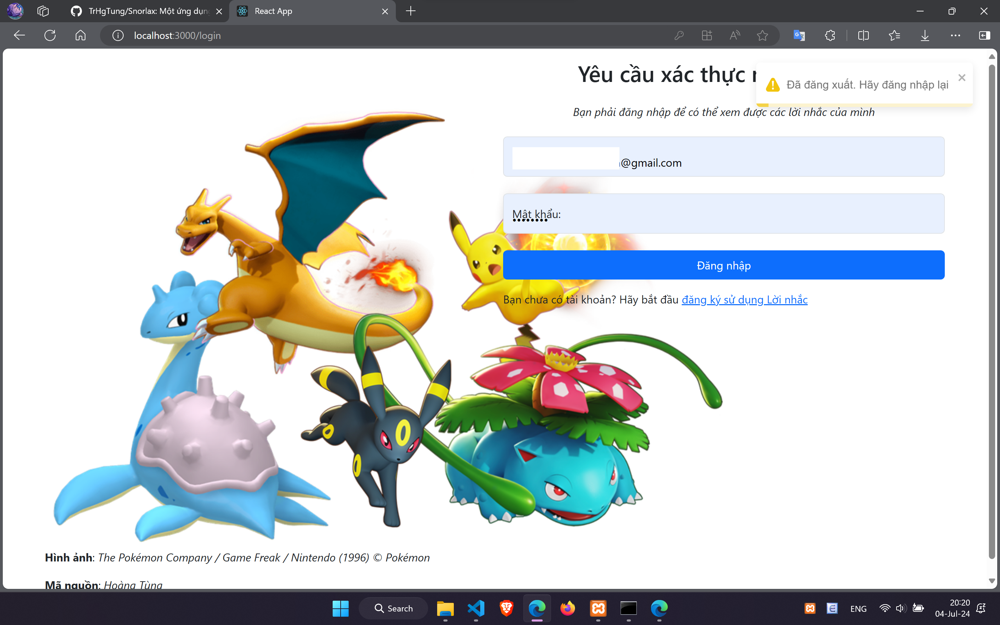
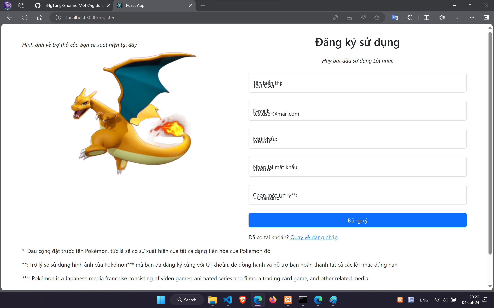
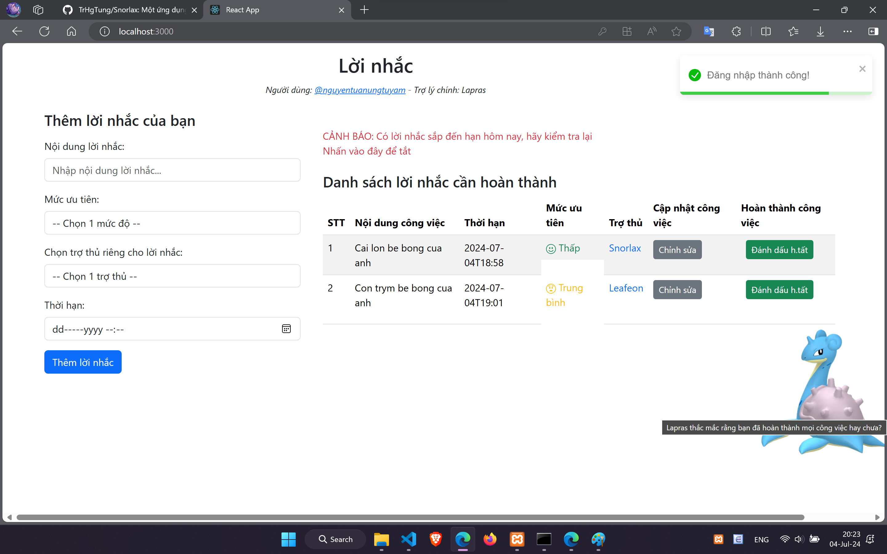
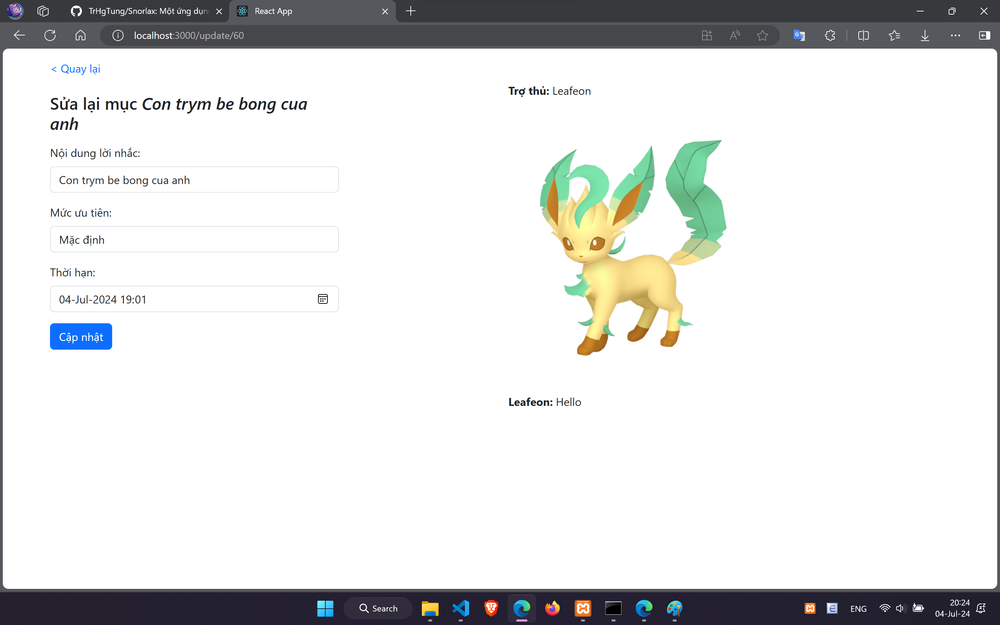
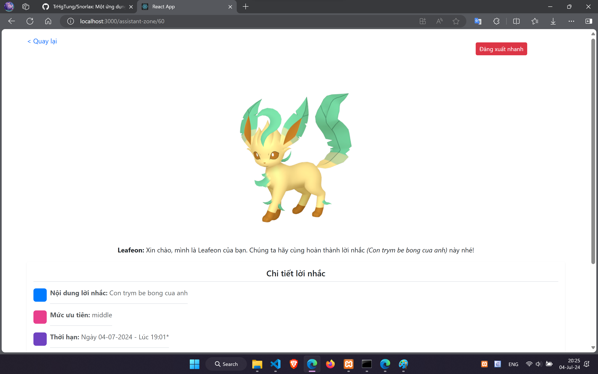
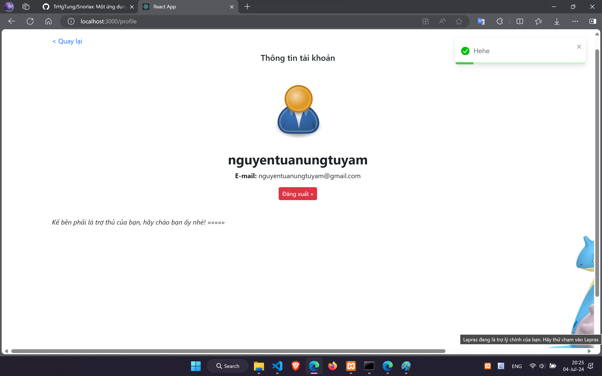
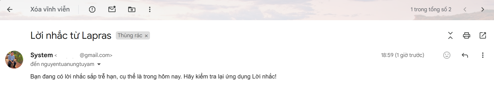

<h1>Snorlax - Một ứng dụng Lời nhắc cơ bản với Laravel và ReactJS</h1>
<h2>GIỚI THIỆU</h2>

<h6>Phiên bản: 1.1</h6>

Một hệ thống phân tán nhằm tạo ra lời nhắc và nhắc nhở cho nhiều người dùng 

    - Chủ thể: Người dùng
    - Kiến trúc phần mềm: Kiến trúc phân tán (Distributed Architecture)

<h2>CÁC CÔNG NGHỆ NỔI BẬT</h2>
1. <b> Laravel </b>:  
- Tài liệu: https://laravel.com/  
- Tham khảo: ChatGPT (https://chat.openai.com/), StackOverFlow (https://stackoverflow.com/), Laracasts (https://laracasts.com/)   
2. <b> ReactJS</b>:  
- Tài liệu: https://react.dev/learn  
- Trang chủ: https://react.dev/  
- Tham khảo: ChatGPT (https://chat.openai.com/), StackOverFlow (https://stackoverflow.com/)  

<h2>CÁC TÍNH NĂNG NỔI BẬT</h2>
<h4>Phía Người dùng:</h4>

1. Đăng nhập, đăng ký, đăng xuất (Sử dụng Bearer Token để xác thực và Sanctum Laravel để lưu phiên đăng nhập người dùng) 
2. Viết lời nhắc và chọn nhân vật trợ thủ cho riêng mình.  
3. Gửi e-mail tự động để nhắc nhở người dùng khi có lời nhắc sắp đến hạn. 
    

> Xem chi tiết [ở đây](##MÔ-TẢ-CHỨC-NĂNG)

 

## LUỒNG NGƯỜI DÙNG (USE-CASE)

` Với vai trò là một người dùng bình thường`

1. Xác thực người dùng:  
   1.1. Nếu đã có tài khoản: đăng nhập  
   1.2. Nếu chưa có tài khoản: đăng ký 
2. Thêm lời nhắc mới: yêu cầu điền đủ thông tin của một lời nhắc, sau đó nhấn Thêm lời nhắc 
3. Xem toàn bộ lời nhắc (của người dùng đã đăng nhập): Xem các thông tin mà người dùng đã cung cấp cho lời nhắc, được lấy từ cơ sở dữ liệu (CSDL) phía Back-end  
4. Xem chi tiết lời nhắc: Xem toàn bộ thông tin của một lời nhắc ở một trang mới, điều này diễn ra sau khi người dùng click vào một lời nhắc  
5. Đánh dấu là hoàn thành: Việc này giúp cho người dùng có thể đánh dấu các lời nhắc là đã hoàn tất, cũng như không còn hiển thị trên giao diện, nhưng vẫn sẽ lưu dưới CSDL với điều kiện `status` được cập nhật thành `0`  
6. Xem thông tin tài khoản (Profile): Xem các thông tin của người dùng đã đăng ký, và có thể đăng xuất nhanh khỏi phiên hiện tại.  
7. Đăng xuất: Xóa phiên hoạt động hiện tại của người dùng, bằng cách xóa các giá trị trong localStorage. Một khi các tính năng khác được vô tình truy cập đến mà không có dữ liệu cần thiết trong localStorage, thao tác truy cập sẽ bị chặn bởi điều kiện trong mã nguồn và trả về trạng thái 401 (Unauthorized) 
8. Gửi e-mail:  
   8.1. Giả tự động gửi e-mail (cố định): Ở giao diện hiển thị danh sách lời nhắc, sẽ có hàm kiểm tra giá trị `deadline`, nếu trùng với ngày hiện tại trên máy chủ, sẽ hiển thị một cảnh báo và khuyến khích người dùng click vào để tắt nó đi. Nhưng bản chất sẽ thực thi việc gửi e-mail cố định này.  
   8.2. Tự động gửi e-mail: Đã được thiết lập (có thể kiểm tra trong commit [61](https://github.com/TrHgTung/Snorlax/commit/caa588304ac161857b864d86ad14422722fdfe46)), bằng cách truy vấn dữ liệu e-mail của người dùng và gửi e-mail từ phía máy chủ. Còn việc hoạt động theo lịch trình hay tự động bằng lệnh command thì cần phải setup trên máy chủ thực.
   > Kỹ thuật SMTP: mục 8.1 dùng PHPMailer, mục 8.2 dùng SendMail có sẵn trong Laravel

## MÔ TẢ CHỨC NĂNG

<h4>1. Xác thực người dùng:</h4>

<h4>2. Thêm và xem danh sách lời nhắc:</h4>

<h4>3. Sửa lời nhắc và đánh dấu hoàn thành:</h4>

<h4>4. Xem chi tiết từng lời nhắc:</h4>

<h4>5. Xem profile:</h4>

<h4>6. Tự động gửi e-mail nhắc nhở đến hạn:</h4>

## MÔ TẢ KĨ THUẬT

> Các response phía dưới tương úng với các dữ liệu được hiển thị ở lần lượt các mục của phần [Mô tả chức năng](##MÔ-TẢ-CHỨC-NĂNG)

<h4>1. Response tất cả lời nhắc:</h4> 
{
    "check_time": "1",
    "get_pokemon_name": [
        {
            "character_name": "Snorlax"
        },
        {
            "character_name": "Leafeon"
        }
    ],
    "get_character_id": [
        {
            "character_id": "POKE2"
        },
        {
            "character_id": "POKE3"
        }
    ],
    "check_pokemon_shiny": [
        {
            "is_shiny": "0"
        },
        {
            "is_shiny": "0"
        }
    ],
    "result": [
        {
            "id": 59,
            "job_id": "JOB202407045728user51520240704",
            "user_id": "user51520240704",
            "assist_id": "ASSIST202407045728user51520240704_2",
            "content": "Cai lon be bong cua anh",
            "priority_level": "easy",
            "deadline": "2024-07-04T18:58",
            "last_modified": "2024-07-04",
            "status": "1"
        },
        {
            "id": 60,
            "job_id": "JOB202407043239user51520240704",
            "user_id": "user51520240704",
            "assist_id": "ASSIST202407043239user51520240704_3",
            "content": "Con trym be bong cua anh",
            "priority_level": "middle",
            "deadline": "2024-07-04T19:01",
            "last_modified": "2024-07-04",
            "status": "1"
        }
    ]
}

<h4>2. Response đăng nhập:</h4>
{
    "user": {
        "id": 44,
        "user_id": "user51520240704",
        "email": "nguyentuanungtuyam@gmail.com",
        "display_name": "nguyentuanungtuyam",
        "email_verified_at": null,
        "assist_id": "5",
        "created_at": null,
        "updated_at": null
    },
    "assist_id": "5",
    "pokemon_name": "Lapras",
    "display_name": "nguyentuanungtuyam",
    "token": "207|Ggv2AanRD8EAQQRNHKEO9upctX7OzXh2E01O3DZg1bd678c5"
}

<h4>3. Response đăng ký:</h4>
{
    "assist_id": "3",
    "user": {
        "user_id": "user260320240704",
        "email": "momshark@mail.net",
        "display_name": "MommyShark",
        "assist_id": "3",
        "id": 45
    },
    "token": "208|dELvq1pU2mVp8FZGJgT75awBuJs9M7CVeb1uHiYA64892dbe"
}
<h4>4. Response một lời nhắc:</h4>
{
    "get_pokemon_name": [
        {
            "character_name": "Snorlax"
        }
    ],
    "get_character_id": [
        {
            "character_id": "POKE2"
        }
    ],
    "check_pokemon_shiny": [
        {
            "is_shiny": "0"
        }
    ],
    "result": {
        "id": 59,
        "job_id": "JOB202407045728user51520240704",
        "user_id": "user51520240704",
        "assist_id": "ASSIST202407045728user51520240704_2",
        "content": "Cai lon be bong cua anh",
        "priority_level": "easy",
        "deadline": "2024-07-04T18:58",
        "last_modified": "2024-07-04",
        "status": "1"
    }
}
<h4>5. Response thêm lời nhắc:</h4>
{
    "author": "Hoang Tung",
    "message_response": "Thuc hien thanh cong",
    "add_job": {
        "content": "Con cac",
        "priority_level": "easy",
        "assist_id": "ASSIST202407043261user51520240704_3",
        "deadline": "2024-07-09T20:33",
        "job_id": "JOB202407043261user51520240704",
        "user_id": "user51520240704",
        "last_modified": "2024-07-04",
        "status": "1"
    },
    "add_assistant": {
        "character_id": "POKE3",
        "assist_id": "ASSIST202407043261user51520240704_3",
        "job_id": "JOB202407043261user51520240704",
        "is_shiny": 1
    }
}
<h4>6. Response profile:</h4>
{
    "message": "User info",
    "data": {
        "id": 44,
        "user_id": "user51520240704",
        "email": "nguyentuanungtuyam@gmail.com",
        "display_name": "nguyentuanungtuyam",
        "email_verified_at": null,
        "assist_id": "5",
        "created_at": null,
        "updated_at": null
    },
    "user_id": "user51520240704"
}

<h2>YÊU CẦU TRƯỚC KHI CÀI ĐẶT SOURCE</h2>

1. Trên máy tính (Test/Dev/Server) đã cài đặt XAMPP (có sẵn MySQL, PHP, Apache, ....) và NodeJS  

2. Kiểm tra PHP đã cài đặt chưa. Mở Command line: chạy lệnh `php --version` , yêu cầu phiên bản PHP phải lớn hơn 8.2  

   > Nếu chạy lệnh `php --version` trả về lỗi, hãy tự tìm cách để thiết lập biến môi trường Windows cho PHP (Gợi ý từ khóa: set environment variable for windows) 

3. Đã cài đặt Composer (https://getcomposer.org/download/). Composer khi cài đặt phải nhận phiên bản PHP đang có trên máy  

4. Tương tự kiểm tra NodeJS đã được cài đặt hay chưa bằng lệnh `node -v` hoặc `node --version`  

5. Cấu hình PHPMailer: truy cập đến thư mục `HandleSendMail\sendmail\app\Http\Controllers` và mở file class controller có tên 'MainController.php' và chỉnh sửa các thông số bị ẩn dưới dạng **\*\*\*\*** ở các dòng 39, 40 và 45
   > Gợi ý cho các bạn hãy tạo một mật khẩu ứng dụng bằng tài khoản Google, sau đó thêm mật khẩu của ứng dụng bạn vừa tạo vào dòng 40: '$mail->password = 'mật-khẩu-16-ký-tự-của-bạn'', còn ở 2 dòng 39 và 45 chính là địa chỉ Gmail của bạn.
   >  
6. Thiết lập mục 5 tương tự với file .env trong source `HandleSendMail`, bởi vì SMTP không còn dùng PHPMailer, mà dùng tính năng gửi e-mail được tích hợp sẵn trong Laravel.

<h2>CÁCH CÀI ĐẶT SOURCE</h2>

<h4>Với source Laravel (Xử lý Lời nhắc):</h4>

> Mở Terminal/Command Line: trỏ tới source Laravel với lệnh `cd ToDoAPI`  

1. Chạy XAMPP với quyền admin, khởi động 2 dịch vụ: Apache và MySQL  
2. Thực hiện `git clone` source về, trong hệ quản trị CSDL MySQL (PHPMyAdmin : truy cập bằng trình duyệt với địa chỉ: 127.0.0.1:80/phpmyadmin) -> tạo 1 CSDL mới, đặt tên gì cũng được (VD: todoapi) 
3. Mở command line: cd <tên thư mục chứa source>, chạy lệnh `composer update` (nếu ko được thì `composer install`)  
4. Copy file .env.example thành 1 file mới, và đổi tên file mới này thành .env  
5. Mở file .env mới tạo, tìm tới dòng DB_DATABASE=project và thay thế 'project' thành tên cơ sở dữ liệu được tạo trong MySQL (todoapi) 
6. Chạy lệnh `php artisan key:generate` để tạo khóa truy cập cho localhost (Laravel)  
7. Chạy lệnh `php artisan migrate` để ánh xạ từ model lên cơ sở dữ liệu MySQL. Nếu lỗi xảy ra, hãy migrate file `2024_06_05_044712_init_architecture.php` và `2014_10_12_000000_create_users_table.php` trong thư mục "database/migrations" vào MySQL.  
8. Chạy lệnh `php artisan serve --port 4401`. Lúc này ứng dụng sẽ chạy trên 127.0.0.1:4401, mở trình duyệt và truy cập bằng địa chỉ này  

<h4>Với source Laravel (Xử lý Gửi e-mail: `HandleSendMail`):</h4>

> Mở Terminal/Command Line: trỏ tới source Laravel với lệnh `cd HandleSendMail/sendmail`  

1. Chạy XAMPP với quyền admin, khởi động 2 dịch vụ: Apache và MySQL  
2. Thực hiện `git clone` source về, trong hệ quản trị CSDL MySQL (PHPMyAdmin : truy cập bằng trình duyệt với địa chỉ: 127.0.0.1:80/phpmyadmin) -> tạo 1 CSDL mới, đặt tên gì cũng được (VD: handlesendmail) 
3. Mở command line: cd <tên thư mục chứa source>, chạy lệnh `composer update` (nếu ko được thì `composer install`)  
4. Copy file .env.example thành 1 file mới, và đổi tên file mới này thành .env  
5. Mở file .env mới tạo, tìm tới dòng DB_DATABASE=project và thay thế 'project' thành tên cơ sở dữ liệu được tạo trong MySQL (handlesendmail) 
   Và thiết lập gửi e-mail trong file .env:  
   ...  
   `MAIL_MAILER=smtp
MAIL_HOST=smtp.gmail.com
MAIL_PORT=587
MAIL_USERNAME=e-mail-của-bạn@gmail.com 
MAIL_PASSWORD=mật-khẩu-google-app-password
MAIL_ENCRYPTION=tls
MAIL_FROM_ADDRESS="e-mail-của-bạn@gmail.com"
MAIL_FROM_NAME="Administrator"` 
   ...  
6. Chạy lệnh `php artisan key:generate` để tạo khóa truy cập cho localhost (Laravel)  
7. Chạy lệnh `php artisan migrate` để ánh xạ từ model lên cơ sở dữ liệu MySQL. Nếu lỗi xảy ra, hãy migrate file `2024_07_04_093234_init_migration.php` trong thư mục "database/migrations" vào MySQL.  
8. Chạy lệnh `php artisan serve --port 4401`. Lúc này ứng dụng sẽ chạy trên 127.0.0.1:4401, mở trình duyệt và truy cập bằng địa chỉ này  

<h4>Với source ReactJS (Front-end):</h4>

> Mở Terminal/Command Line: trỏ tới source ReactJS với lệnh `cd ReactJS\my-app`

1. Chạy lệnh `npm install` 

<h2>CÁCH CHẠY SOURCE</h2>
<h4>Với source Laravel (Xử lý Lời nhắc):</h4>
1. Chạy XAMPP với quyền admin, khởi động 2 dịch vụ: Apache và MySQL  
2. Chạy lệnh `php artisan serve --port 4401`. Lúc này ứng dụng sẽ chạy trên http://127.0.0.1:4401, mở trình duyệt và truy cập bằng địa chỉ này  

<h4>Với source Laravel (Xử lý Gửi e-mail):</h4>
1. Chạy XAMPP với quyền admin, khởi động 2 dịch vụ: Apache và MySQL  
2. Chạy lệnh `php artisan serve --port 5000`. Lúc này ứng dụng sẽ chạy trên http://127.0.0.1:5000, mở trình duyệt và truy cập bằng địa chỉ này  

<h4>Với source ReactJS (Front-end):</h4>
1. Chạy lệnh `npm start` 
2. Truy cập trong trình duyệt: http://127.0.0.1:3000  

> 127.0.0.1 chính là địa chỉ localhost 

<h2>CÁC LỖI PHÁT SINH</h2>

- Lỗi 419: Nếu phát sinh lỗi 419 khi các bạn kiểm thử bằng các công cụ test API (Postman / BurpSuite / JMeter / ...): Hãy thêm 2 dòng này vào cuối file .env của cả 2 source Laravel (pass lỗi 419 CSRF)

`SESSION_DOMAIN=localhost
SANCTUM_STATEFUL_DOMAINS=localhost`
 

- Lỗi hiển thị hình ảnh (đã sửa - phiên bản 1.1): Hãy tự chuẩn bị hình ảnh trong thư mục `.\ReactJS\my-app\public\assets\assistant_zone\***.png`  

- Lỗi CORS: Mở file config/cors.php (trong source Laravel) -> cập nhật các giá trị theo mẫu sau (trong object return):  
    'paths' => ['api/*', 'sanctum/csrf-cookie'],

    'allowed_methods' => ['*'],

    'allowed_origins' => ['*', 'http://localhost:3000'], // thay đổi port nếu source React chạy trên cổng khác 3000

    'allowed_origins_patterns' => [],

    'allowed_headers' => ['*'],

    'exposed_headers' => [],

    'max_age' => 0,

    'supports_credentials' => true,

   

<h3>LIÊN HỆ VÀ DONATE</h3>

Các bạn nếu thích dự án này, mong muốn có thêm tính năng mới (mở rộng dự án) hoặc chỉ đơn giản là muốn donate cho tôi ☕☕☕; hãy liên hệ với tôi qua Telegram: <i>@trhgtung</i> hoặc comment tại video bất kỳ với nội dung bạn mong muốn trên kênh YouTube: <a href="https://www.youtube.com/@TungSupport">@TungSupport</a>

Xin cảm ơn! 😍😍😍

<h3>NẾU CÓ LỖI KHÁC XẢY RA / MUỐN ĐÓNG GÓP</h3>

- Các bạn muốn báo cáo lỗi: Hãy vào phần `Issues`

- Các bạn muốn đóng góp thêm tính năng: Hãy vào phần `Pull requests`

- Các bạn muốn báo cáo lỗi và tự sửa lỗi đó luôn: Thì làm như 2 mục trên 😆😆😆 và các bạn quá tuyệt vời 😎😎😎

> <i>Tại sao dự án có tên là Snorlax</i>?   
> ... Đây là tên của một loài Pokémon ít hoạt động  
